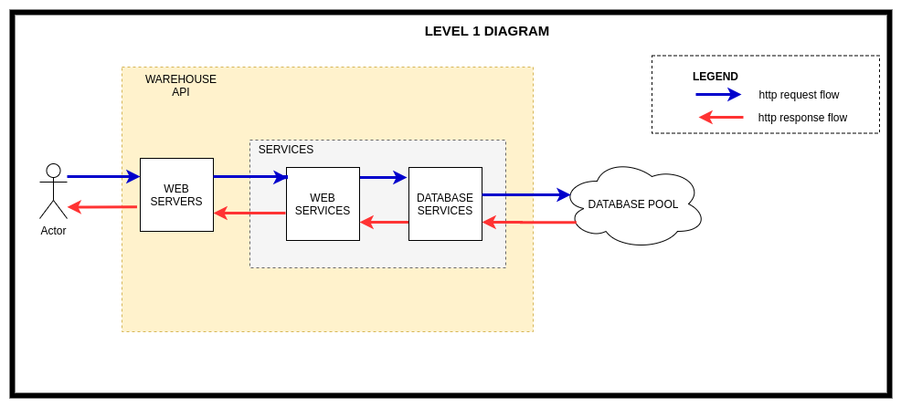
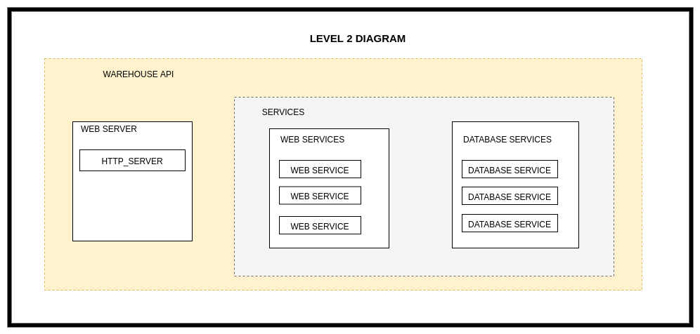
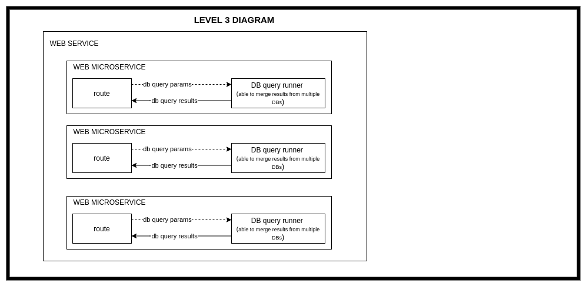

# warehouse_api

This is an integrated API that is meant to provide certain data to the clients as extracted from a range of databases
in a warehouse

## Demos

- [Demo Swagger docs](https://warehouse.sopherapps.com/docs)
- [Demo ReDoc docs](https://warehouse.sopherapps.com/redoc)

## Dependecies

- [FastAPI](https://fastapi.tiangolo.com/) as server
- [uvicorn](www.uvicorn.org) as the server framework to run on
- [SqlAlchemy](https://www.sqlalchemy.org/) for running the database queries

## Design

We are following the service-oriented-architecture (SOA) to make it easier for us to split things up if we ever need to.

The original designs were drawn using [draw.io](https://drive.google.com/file/d/1T_MGu49zsf7bjWeqI8cXAvPBRjrSB4NQ/view?usp=sharing)

### Level 1



### Level 2



### Level 3 [Web service]



## ToDos


## How to run [code samples are for linux]

- Clone the repo

```bash

git clone https://github.com/Tinitto/warehouse_api.git
```

- Enter the root directory and create virtual environment

```bash

cd warehouse_api && python3.7 -m venv env
```

- Install dependencies

```bash

source env/bin/activate && pip install -r requirements.txt
```

- Create the `.env` file and modify the variables in there to what suits you. Be sure to update 
all database URI's to existing postgres database uri

```bash

cp .env.example .env
```

- Run the server

```bash

python main.py
```

- Open the app docs at [http://localhost:5400/docs](http://localhost:5400/docs) for Swagger docs
 or [http://localhost:5400/redoc](http://localhost:5400/redoc) for ReDoc docs. 
 **(the port corresponds to what you have in your .env file)**


## How to Test

**This application uses snapshot testing for data analytics system back ends as introduced in 
the [data-science-snapshot-testing repo](https://github.com/Tinitto/data-science-snapshot-testing)**
 
- Clone the repo

```bash

git clone https://github.com/Tinitto/warehouse_api.git
```

- Enter the root directory and create virtual environment

```bash

cd warehouse_api && python3.7 -m venv env
```

- Install dependencies

```bash

source env/bin/activate && pip install -r requirements.txt
```

- Create the test database on your local postgreSQL server [You must have installed this already](https://www.postgresql.org/docs/10/tutorial-install.html)

```bash

sudo -su postgres
createdb test_warehouse_api
```

- Change the timezone of the `test_warehouse_api` database to 'UTC'

```bash

psql test_warehouse_api
ALTER DATABASE postgres SET timezone TO 'UTC';
\q
exit
```

- Restart the postgreSQL service to allow the changes to take effect

```
#!bash

sudo systemctl restart postgresql
```

- Run the tests with pytest

```
#!bash

pytest
```

## License

Copyright (c) 2020 [Martin Ahindura](https://github.com/Tinitto) Licensed under the [MIT License](./LICENSE)
